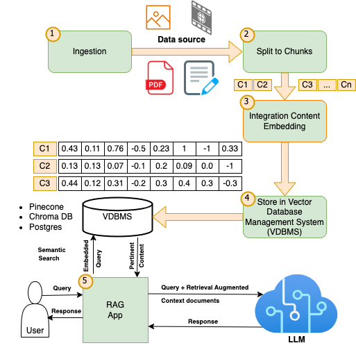

# RAG Chatbot Application

## Description

This Streamlit application creates a pedagogical chatbot augmented by document retrieval (RAG - Retrieval Augmented Generation). The chatbot uses texts extracted from PDF documents and images uploaded by the user to respond to context-based questions. It is a valuable tool for education and quick information retrieval from various documents.




## Features

- Upload and process multiple PDF files and images.
- Extract text from PDFs and images.
- Generate contextual responses based on the extracted content.

## Installation

To install and run this application, follow these steps:

1. **Prerequisites**:
   - Python 3.10 or newer.
   - Tesseract-OCR for text extraction from images.

2. **Installing Tesseract-OCR**:
   On Ubuntu:
   ```bash
   sudo apt update
   sudo apt install tesseract-ocr
   ```

   On Windows, download and install Tesseract from [this link](https://github.com/UB-Mannheim/tesseract/wiki), and make sure to add the path to the Tesseract executable to your `PATH` environment variable.

3. **Clone the repository or download the files**:
   ```bash
   git clone [URL_OF_REPO]
   cd rag3
   ```

4. **Install Python dependencies**:
   ```bash
   pip install -r requirements.txt
   ```

5. **Configure environment variables**:
   Copy the `.env.sample` file to `.env` and adjust the necessary values:
   ```bash
   cp .env.sample .env
   ```

6. **Launch the application**:
   ```bash
   streamlit run app.py
   ```

## Usage

- Launch the application and navigate through the Streamlit interface.
- Use the file uploader to upload PDF documents and images.
- Pose your questions to the chatbot via the user interface to receive answers based on the content of the uploaded documents.

## Development

- `app.py`: The main application file, modify it to adjust the user interface or high-level logic.
- `models.py`: Contains logic for file processing and response generation; modify this file to adjust processing or interaction algorithms.

## Support

For assistance or to report issues, open an issue in the application's GitHub repository or contact the developer by email.
